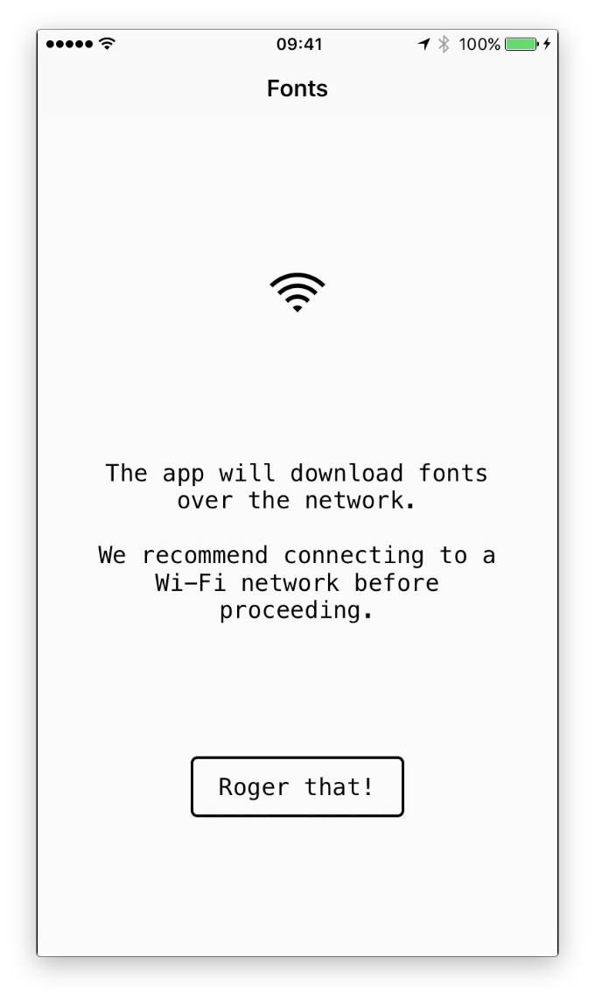
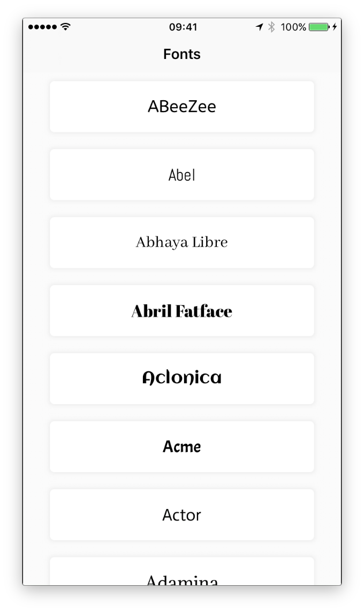
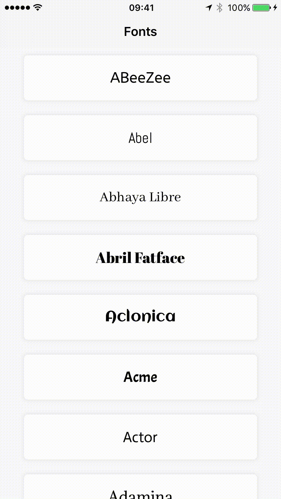

# Type

> Preview the different typefaces on Google Fonts

## Screenshots



## Requirements

1. Xcode 8.3
2. Cocoapods
3. Google API key

## Installation
**1. Source code:**

```
git clone git@github.com:simonlee2/Google-Font-Viewer.git
```

**2. Download dependencies**

Cocoapods is used to manage dependencies.

```
pod install
```

**3. Get Google Fonts API key**

Get your keys on [Google Fonts Developers page](https://developers.google.com/fonts/docs/developer_api#identifying_your_application_to_google)

**4. Set up key files for the project"**

`keyfile` is a script that will generate the `.swift` file with your api key so that it can be used in the app.

```
./keyfile <yourAPIKey>
```

**5. Build & Run**

You should now be able to build and run the project in Xcode 8.

## Demo


